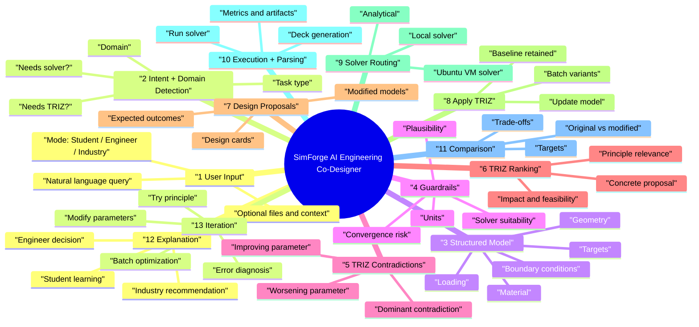

# SimForge 13-Layer Flow Mind Map

This is the canonical product flow for SimForge as an AI engineering co-designer with TRIZ integrated into the solver loop.

## Implementation Fit

- Stages 1-3 fit in `src/App.jsx` through `handleSendMessage` and `processFormulationNL`.
- The canonical stage model, guardrails, TRIZ proposals, solver routing, comparison, and iteration prompts live in `src/services/simforgeFlow.js`.
- TRIZ contradiction detection and principle application continue to use `src/services/triz.js`.
- Solver execution continues to use `src/services/solvers.js`, `/api/simulate`, and `server/services/externalSolvers.js`.
- Ubuntu VM solver transport is handled by `server/services/externalSolvers.js`.
- Stage status is attached to the active model under `SIMFORGE_FLOW`.
- TRIZ proposal metadata is attached to the active model under `TRIZ_PROPOSAL`.
- Before/after comparison baselines are captured in `App.jsx` when a TRIZ principle is applied.

## Runtime Flow

1. User sends a query in the chat pane.
2. SimForge creates a flow plan: intent, task type, solver/TRIZ need, guardrails, TRIZ contradiction, and solver route.
3. The chat response includes a Mermaid mind map plus the current 13-stage status.
4. The model pane receives the structured model plus `SIMFORGE_FLOW` metadata.
5. If TRIZ is relevant, the TRIZ wizard ranks principles and can apply one to the model.
6. Applying TRIZ saves the original model/results as the comparison baseline.
7. Running the solver completes routing, execution, parsing, explanation, and before/after comparison.
8. The final chat message includes Stage 13 iteration choices for redesign, parameter sweeps, batch comparison, or optimization.
