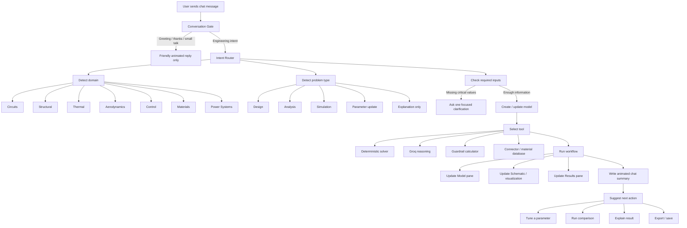

# Smart Brain Flow

This is the intended controller architecture for SimForge. Chat is the primary interface; every other pane is a tool surface.

## Implementation Rules

- Never run a default solver unless the detected problem type matches that solver.
- Always show the detected category and planned action in chat.
- Ask for clarification only when a missing value dominates the answer.
- Use deterministic guardrails for common high-risk engineering tasks.
- Keep tool panes synchronized with chat decisions.
